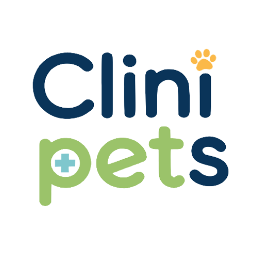
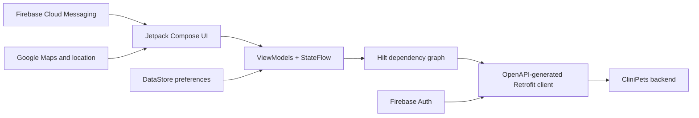

# CliniPets Android

Native Android client for **CliniPets**, a veterinary care and clinic-management platform. The app supports both pet-owner and clinic-staff workflows from a single Kotlin codebase, with role-aware navigation and an API client generated from the backend's OpenAPI contract.

<p align="center">
  
</p>

> This repository is a public engineering snapshot. Running the complete product requires private Firebase configuration and access to the CliniPets backend.

## Product scope

### Pet owners

- Sign in with Google through Firebase Authentication.
- Create and manage pet profiles.
- Browse veterinary services and appointment availability.
- Book and review reservations.
- Review clinical information and manage a pet photo gallery.
- Receive status updates through Firebase Cloud Messaging.

### Clinic staff

- Work from a role-specific agenda.
- Review, confirm, cancel and start appointments.
- Record clinical attention and access pet context.
- Manage medical services.
- Review inventory alerts.

## Architecture



The project keeps screens and state holders grouped by feature. Hilt provides API services and platform dependencies, while Kotlin coroutines and `StateFlow` expose asynchronous UI state. The REST layer is generated from the backend contract to reduce client/server drift.

Key packages:

```text
app/src/main/kotlin/cl/clinipets/
├── core/              # Dependency injection, notifications, session and settings
├── openapi/           # API infrastructure; generated APIs/models are added at build time
└── ui/
    ├── agenda/        # Booking and reservation flows
    ├── auth/          # Google/Firebase authentication
    ├── mascotas/      # Pet profiles, clinical context and gallery
    ├── navigation/    # Type-safe routes and role-aware navigation
    ├── staff/         # Agenda, clinical attention, services and inventory
    └── theme/         # Material 3 design system
```

## Technology

- Kotlin 2 and Java 21
- Jetpack Compose and Material 3
- Navigation Compose with serializable routes
- Hilt dependency injection
- Kotlin coroutines and StateFlow
- Retrofit, OkHttp and OpenAPI Generator
- Firebase Authentication, Cloud Messaging and Crashlytics
- Credential Manager with Google Sign-In
- DataStore Preferences
- Google Maps and device location
- Coil 3 image loading
- JUnit, MockWebServer and coroutine test utilities

## Local development

Requirements:

- Android Studio with JDK 21
- Android SDK 36
- A reachable CliniPets backend exposing `/v3/api-docs`
- A Firebase Android configuration file at `app/google-services.json`
- Local values for the Maps API key and backend URLs

The current build generates its Retrofit client from the backend contract before compiling. The public snapshot expects the development API at `http://homeserver.local:8080/v3/api-docs`; adapt that task to your own environment before building.

```bash
./gradlew assembleDebug
./gradlew testDebugUnitTest
```

Secrets and `google-services.json` are intentionally excluded from version control.

## Related work

- [CliniPets platform backend](https://github.com/Billyflin/clinipets-platform-backend)
- [Billy Martínez — engineering portfolio](https://billyflin.dev)

## Author

**Billy Martínez** — SAP BTP consultant and full-stack/cloud engineer  
[Portfolio](https://billyflin.dev) · [LinkedIn](https://www.linkedin.com/in/billyflin) · [Email](mailto:hello@billyflin.dev)
